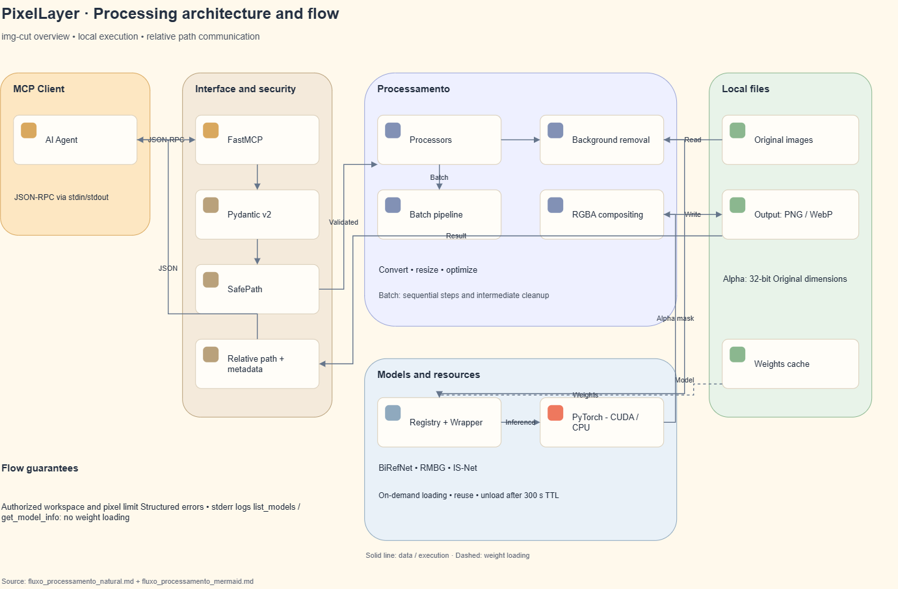
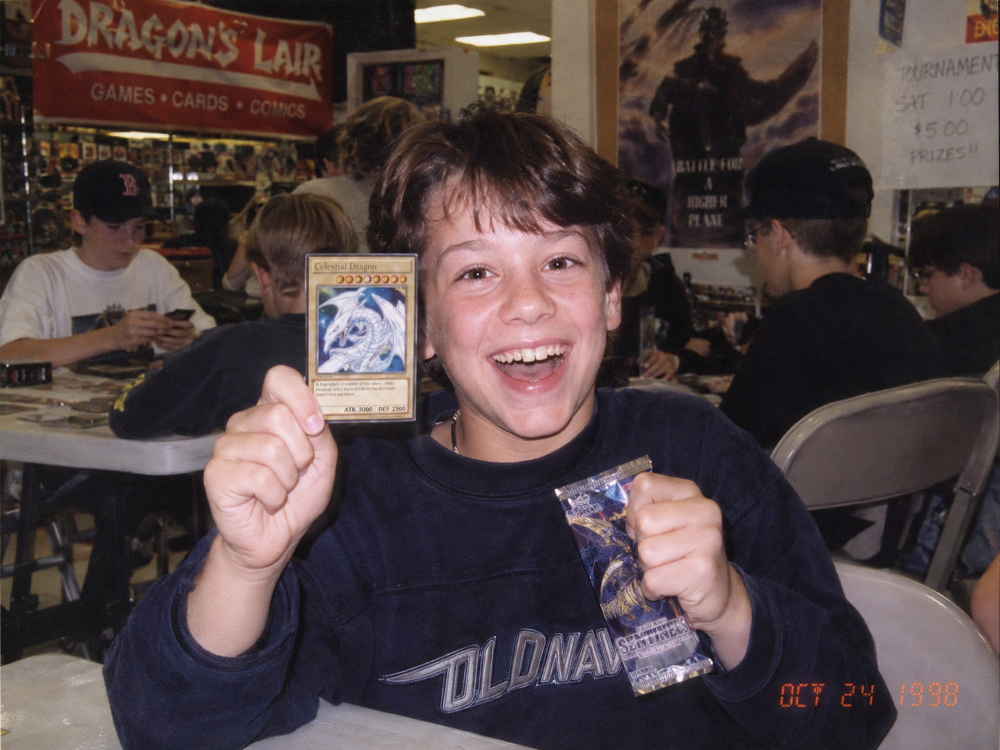
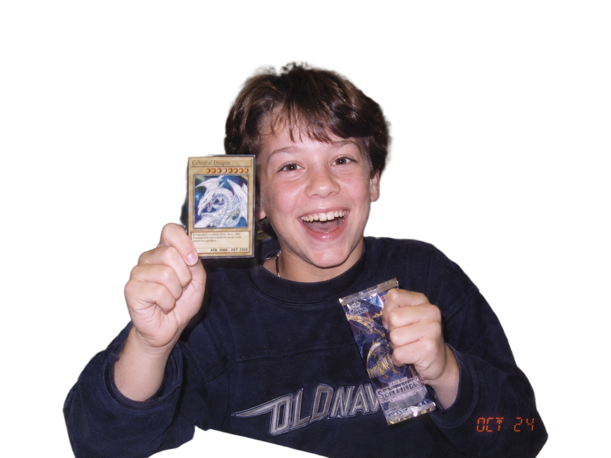
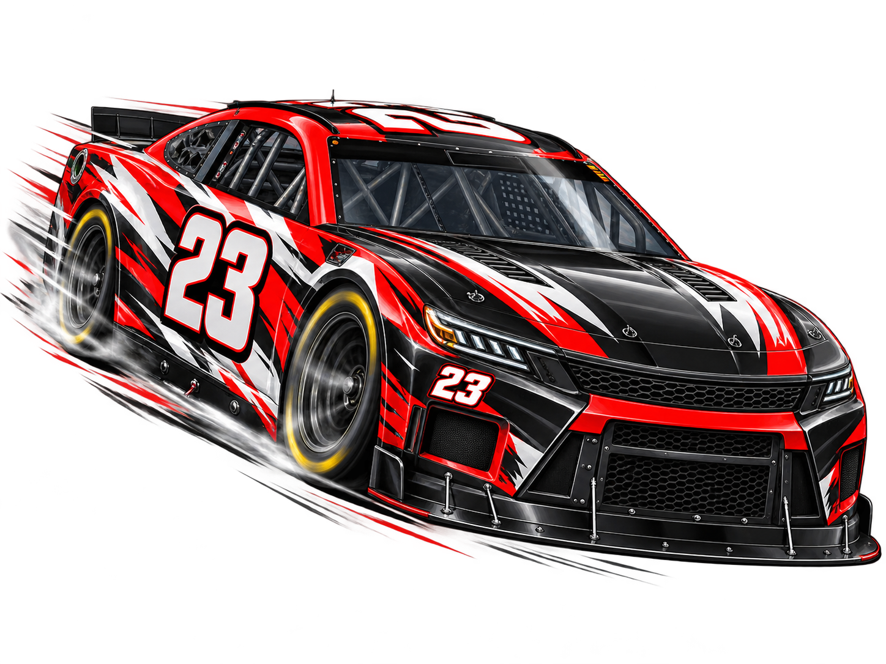

# [PixelLayer](https://pixellayer.web.app/) 🎨

> Local MCP server for AI-powered image processing — background removal, format conversion, optimization, and vectorization.

## What is this?

**PixelLayer** is a Python-based MCP (Model Context Protocol) server that exposes image processing tools to AI coding agents. When you're developing in any repo and need to process images, your agent calls PixelLayer's tools via MCP — no base64, no token bloat, just file paths in and out.

## Performance Highlights

- ⚡ **1.9s warm inference** for AI background removal, with **3.9s cold-start latency**.
- 🪶 **~90 tokens per image operation** through the Path-Only protocol, versus **1.5M+ tokens** for Base64 — a **99.99% reduction**.
- 💰 **~US$0.0000008 estimated context cost per image**, versus approximately **US$9.95** with Base64.

See the [full performance and token report](docs/performance_and_tokens.md) for methodology and detailed benchmarks.

## Key Features

- 🎯 **Perfect Background Removal** — ARGB alpha channel, no fill, no quality loss
- 🤖 **Multi-Model Support** — BiRefNet (general/portrait/matting/hr), RMBG-2.0, IS-Net
- 🖼️ **Format Conversion** — PNG ↔ WebP ↔ JPEG with quality control
- 📐 **Smart Resize** — Aspect-ratio-preserving resize with multiple algorithms
- 🗜️ **Optimization** — File size reduction with configurable quality targets
- ✒️ **Vectorization** — Raster to SVG via vtracer
- ⚡ **Zero Idle Cost** — Models lazy-load on first call, auto-unload after TTL
- 🔌 **MCP Native** — Works with any MCP-compatible agent (Codex, Antigravity, Claude, etc.)

## Architecture

<p align="center">
  
</p>

## Visual Examples

### 1. Background Removal (`remove_background`)

| Before (`input/to-cut.png`) | After (`output/to-cut-nobg.png`) |
| :---: | :---: |
|  |  |

### 2. Raster to Vector SVG (`vectorize_image`)

| Before (`input/carro-to-svg.png`) | After (`output/carro-to-svg.svg`) |
| :---: | :---: |
|  |  |

## Quick Start

```bash
# Install dependencies
uv sync

# Run the MCP server (stdio transport)
uv run python -m src.mcp_server

# Or with pip
pip install -e .
python -m src.mcp_server

# Or run with Docker (SSE transport on port 8000)
docker compose up -d
```

## Agent Configuration

Configure **pixellayer** in your preferred AI agent environment. Replace `<path-to-pixellayer>` with your local repository clone path and `<path-to-workspaces>` with the directories authorized for image processing.

### 1. Antigravity CLI (AGY)
**Config File:** `~/.gemini/config/mcp_config.json` (JSON)

```json
{
  "mcpServers": {
    "pixellayer": {
      "command": "<path-to-pixellayer>/.venv/bin/python",
      "cwd": "<path-to-pixellayer>",
      "args": [
        "-m",
        "src.mcp_server"
      ],
      "env": {
        "PYTHONPATH": "<path-to-pixellayer>",
        "PIXELLAYER_ALLOWED_WORKSPACES": "<path-to-workspaces>",
        "PIXELLAYER_LOG_DIR": "<path-to-pixellayer>/logs",
        "PIXELLAYER_MODEL_TTL": "300"
      }
    }
  }
}
```

### 2. Codex CLI
**Config File:** `~/.codex/config.toml` (TOML)

```toml
[mcp_servers.pixellayer]
command = "<path-to-pixellayer>/.venv/bin/python"
cwd = "<path-to-pixellayer>"
args = ["-m", "src.mcp_server"]
startup_timeout_sec = 30.0
tool_timeout_sec = 120.0

[mcp_servers.pixellayer.env]
PYTHONPATH = "<path-to-pixellayer>"
PIXELLAYER_ALLOWED_WORKSPACES = "<path-to-workspaces>"
PIXELLAYER_LOG_DIR = "<path-to-pixellayer>/logs"
PIXELLAYER_MODEL_TTL = "300"
```

### 3. Claude Code
**Config File:** `.mcp.json` (in your project root) or `~/.claude.json` (JSON)

```json
{
  "mcpServers": {
    "pixellayer": {
      "command": "<path-to-pixellayer>/.venv/bin/python",
      "args": [
        "-m",
        "src.mcp_server"
      ],
      "env": {
        "PYTHONPATH": "<path-to-pixellayer>",
        "PIXELLAYER_ALLOWED_WORKSPACES": "<path-to-workspaces>",
        "PIXELLAYER_LOG_DIR": "<path-to-pixellayer>/logs",
        "PIXELLAYER_MODEL_TTL": "300"
      }
    }
  }
}
```

*Or configure directly via CLI:*
```bash
claude mcp add pixellayer <path-to-pixellayer>/.venv/bin/python -m src.mcp_server -e PYTHONPATH=<path-to-pixellayer> -e PIXELLAYER_ALLOWED_WORKSPACES=<path-to-workspaces>
```

### 4. OpenCode
**Config File:** `~/.config/opencode/opencode.json` (or `opencode.json` in project root) (JSON)

```json
{
  "$schema": "https://opencode.ai/config.json",
  "mcp": {
    "servers": {
      "pixellayer": {
        "type": "local",
        "command": [
          "<path-to-pixellayer>/.venv/bin/python",
          "-m",
          "src.mcp_server"
        ],
        "cwd": "<path-to-pixellayer>",
        "environment": {
          "PYTHONPATH": "<path-to-pixellayer>",
          "PIXELLAYER_ALLOWED_WORKSPACES": "<path-to-workspaces>",
          "PIXELLAYER_LOG_DIR": "<path-to-pixellayer>/logs",
          "PIXELLAYER_MODEL_TTL": "300"
        },
        "disabled": false,
        "timeout": 120000
      }
    }
  }
}
```

## Remote & Cloud Deployment (VPS / GPU Cloud)

Need GPU acceleration or want to host PixelLayer on a VPS/Cloud provider for your team?

- 📖 **Comprehensive Deployment Guide**: [`docs/cloud_vps_deploy.md`](docs/cloud_vps_deploy.md)
- 🐳 **Docker & Docker Compose**: Run with persistent volumes for models, logs, and workspaces.
- ⚡ **NVIDIA GPU Passthrough**: Accelerate inference to ~200ms using `docker-compose.gpu.yml`.
- 🔒 **Secure Connection Options**:
  - **SSH Bridge** (Zero open ports, native encryption)
  - **Tailscale / WireGuard** (Private mesh network)
  - **Caddy / Nginx Reverse Proxy** (HTTPS with Bearer Token authentication)

## Available Tools

| Tool | Description |
|---|---|
| `remove_background` | Remove background with alpha transparency (AI) |
| `batch_remove_background` | Batch background removal across multiple images |
| `crop_image` | Geometric crop (coordinates or autocrop trimming empty margins) |
| `convert_format` | Convert between PNG/WebP/JPEG |
| `optimize_image` | Reduce file size with quality control |
| `resize_image` | Resize preserving aspect ratio |
| `vectorize_image` | Convert raster to SVG |
| `batch_process` | Chain multiple sequential operations on an image |
| `list_models` | List available models (no GPU load) |
| `get_model_info` | Model details and capabilities |
| `save_image` | Copy/relocate image within workspace (Path-Only) |

## How It Works

1. Your AI agent discovers PixelLayer tools via MCP
2. Agent calls a tool with an **image file path** + parameters
3. PixelLayer processes the image locally (lazy-loads model if needed)
4. Returns the **output file path** + metadata (size, dimensions, reduction %)
5. **No image data flows through the MCP protocol** — only paths and metadata

## License

MIT

---

[Explore PixelLayer](https://pixellayer.web.app/) — the local MCP workflow for fast, token-efficient image processing.
