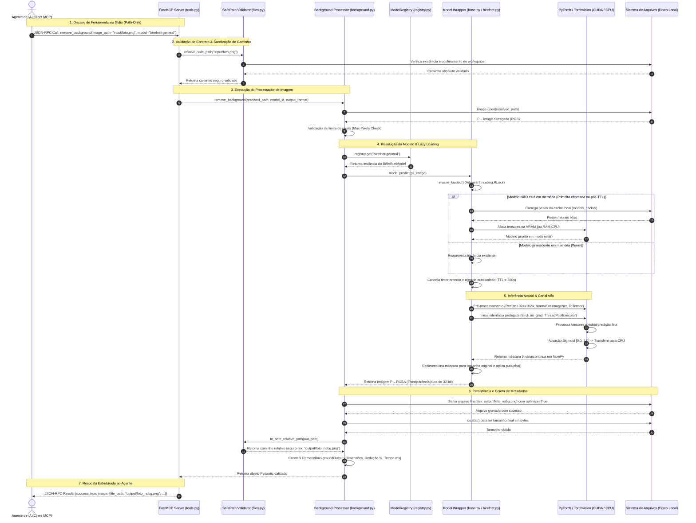
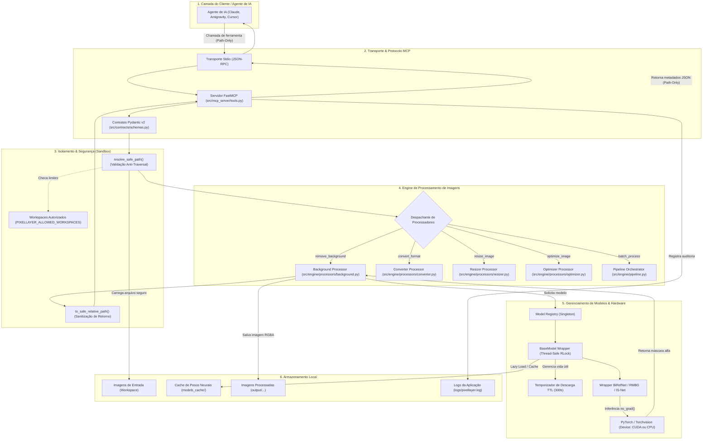
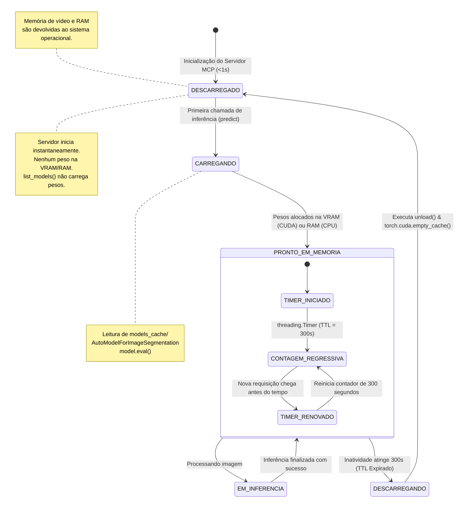
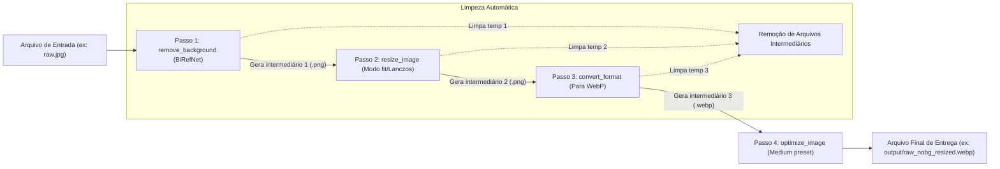

# Diagramas de Fluxo do PixelLayer (Mermaid)

Este documento reúne os diagramas arquiteturais e comportamentais do **PixelLayer** (`img-cut`) expressos em formato **Mermaid**. Os diagramas cobrem a sequência cronológica completa, a topologia de componentes, a máquina de estados do ciclo de vida dos modelos (*Zero Idle / Lazy Loading*) e o fluxo encadeado de pipeline em lote.

---

## 1. Diagrama de Sequência Ponta a Ponta

Este diagrama detalha a troca de mensagens entre todos os módulos desde o disparo da ferramenta pelo Agente de IA até a entrega final do caminho relativo seguro e dos metadados.

---

## 2. Topologia Arquitetural e Fluxo de Dados

Este diagrama visualiza a divisão das camadas lógicas, componentes internos e interfaces de proteção do sistema.

---

## 3. Máquina de Estados: Ciclo de Vida dos Modelos (Zero Idle)

Este diagrama representa o ciclo de vida dos modelos neurais em memória. Mostra como o sistema mantém **recursos ociosos nulos** no arranque do servidor e descarrega automaticamente os pesos após inatividade.

---

## 4. Diagrama de Fluxo do Pipeline em Lote (`batch_process`)

Quando o cliente solicita a execução sequencial encadeada de múltiplos passos em uma única invocação, o pipeline orquestra a saída de um processador como entrada do próximo, limpando arquivos intermediários automaticamente.

